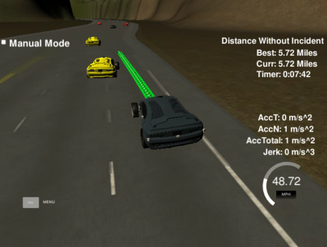
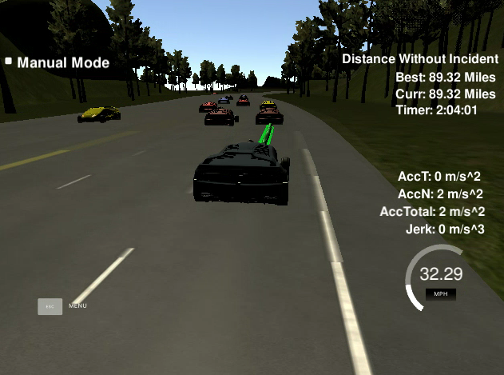
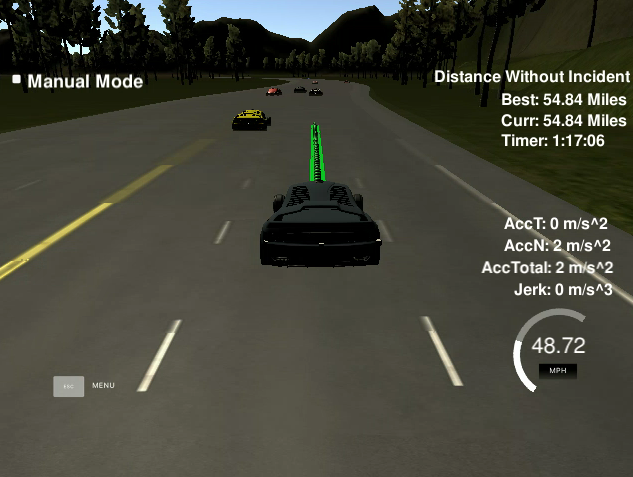
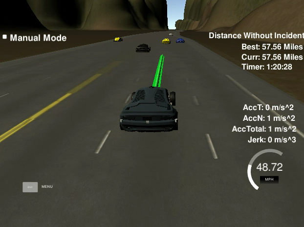

# Writeup
## Project: Highway Driving / Path Planning

### 1. Compilation
The code compiles correctly. Just execute following in the project folder. 
```
mkdir build && cd build
cmake .. && make
./path_planning
```

### 2. Valid Trajectories 
The car is able to drive at least 4.32 miles without incident, at least if non of the other car's makes a critical driving mistake such as, tough some evasive maneuver has been successful it would certainly violate the jerk limitations: (click on the video below)

[](doc/intended_crash.mp4)

The car drives according to the speed limit and the maximum acceleration and jerk are not exceeded most the time. Car does not have collisions, except it can't avoid it because they are caused by the other vehicles. The car stays in its lane, except for the time between changing lanes and thereby is able to change lanes. The lane change algorithm is pretty conservative but relies heavily on constant velocity profiles. As some vehicles randomly decelerate, sometimes issues occur if the vehicle at the target decelerates spontantously.

As everything works normal especially the other vehicle the algorithm is capable driving for a very long distance:



### 3. Model Description

The algorithm consists of three essentials parts. The first part is sensor fusion, which predicts and calculates relevant objects for the scenario. These are passed to the second part, the behavior planning. In the behaviorplanning it's validated if a lane change is neccessary and possible given on the sensor fusion data. The target lane is then commanded to the trajectory generation. It's main task is to generate a feasible trajectory by filtering the waypoints and adapting their position and contour to the target lane. Additionally a longituindal trajectory is calculated based on the vehicle predictions.

#### Sensor Fusion

The sensor fusion basically predicts for every vehicle their future motion. Therefore a constant velocity model is used, which assumes that the vehicle keeps it velocity over time. Additionally, it is assumed that the vehicle keeps it lane over the prediction horizon.

Finally a matrix is calculated, which summarizes which vehicle is relevant for each case. Therefore a matrix is build, which calculates for the ego-vehicles surroundings, where which vehicle as to be considered and puts the corresponding vehicle ID in it. E.g. the vehicle id in 'Front' is used for Lane Keeping and vehicle following.

| []()       |               |             |
|------------|---------------|-------------|
|  Left Rear | Left Side     | Left Front  |
|  Rear      | Ego - Vehicle | Front       |
| Right Rear | Right Side    | Right Front |

The Front and Rear vehicle id are calulated by checking a certain range in front and behind the ego-vehicle and the closest one is put in the corresponding cell. However, only if the vehicle does not fit in 'Left/Right Side'. These cells contains vehicle's which prohibit a lane change. Their ID's are calculated by finding vehicle's which are in a certain range on the left/right lane in front or behind the vehicle. These range in front of the vehicle is limited by the maximum of a minimum distance and a minimum time gap. In rear direction also the delta velocity of the ego vehicle to the target vehicle is to considered to account for fast approaching vehicles.
 
#### Behavior Planning

The behavior planning module basically decides if the vehicle should stay in lane or if another lane is suitable e.g. due to a slower vehicle ahead. However, only a very short strategy is calculate so only lane changes by a single lane are considered, two consecutive lanechanges are not used for simplicity reasons, but they were for sure helpful e.g. the ego and the neighbouring lanes are blocked but the second right lane would be free, so this would be an appropriate choice.

The main conditions for a lane changes are 

* A vehicle is in front, which is slower than our desired speed
* The side entry in the previously explained occupancy matrix is not used.
* Either The Front entry in the target lane is not occupied or the vehicle there drives at least 1 m/s faster than the vehicle on our current lane and the time gap is greater than the timegap on our current lane.
* The last lane change is at least 5 seconds ago.

Here are two examples (click the images for the corresponding video):

1. A lane change to the right is conducted as the vehicle ahead of the ego vehicle is slower, the left lane is blocked so we choose the right lane. 

[](doc/lanechange1.mp4)


2. A lane change to the right is conducted as the vehicle ahead of the ego vehicle is slower, the vehicle in the left lane is not driving significantly faster. As the blue vehicle is blocking a lane change to the right for some seconds it takes a short time until the lane change is performed.

[](doc/lanechange2.mp4)


#### Trajectory Planning

The trajectory planning is designed pretty simple. In a first step the path is smoothed based on the map data and the target lane. First we gather points for the fit which lie 1.5 seconds ahead of the current vehicle's position and cover a distance of 120m. The lookahead is chosen to give a polynomial fit some space to design a smooth trajectory e.g. during lane changes. The initial position and its derivative are set constant from the current vehicle state if no prior trajectory was calculated or taken from the previous trajectory (evaluated at 400ms) in order to aquire a smooth and continous path. Then a polynomial fit with a quintic polynomial is conducted [main.cpp; lines(318:338)]. For further reuse the resulting polynomial is discretized.

With this smoothing the lateral path is basically obtained. The missing piece is the longitudinal part. First we check if in previous steps a longitudinal trajectory was already calculated. If this is the case the algorithm use it as starting point, if not the current vehicle state is used for initialization [main.cpp: lines(372:384)].
Then the actual longitudinal trajectory is calculated by a so-called model control loop, which effectively applies a controller to the states to acquire a safe distance to vehicle's ahead or to maintain a constant velocity. If a vehicle is ahead the control is applied much tighter than in speed control phase. The controller outputs a jerk, which then is limited and integrated to an acceleration, which is then limited again to the feasible range. The subsequent integration steps lead to the reference trajectory and an s-(position)-profile.

Using the resulting s-profile the prior generated path is evaluated to obtain the output path [main.cpp lines(485:492)]. The part of the old trajectory up to the evaluation point at 400ms is reused and is also put to the output vector but obviously before the new calculated trajectory part.


### 4. Reflection

Though this algorithm is pretty simple it performs quite well e.g. running for about 90 miles without an incident, it is limited in several cases. However, no safety guarantees can be made as e.g. the path smoothing can lead in other scenarios to a violation of the track limits. Also the longitudinal trajectory can not guarantee to be collision free at all time. For further improvement a sampled polynomial approach can help or from my point of view a numerical optimization would be most suitable. As a highway is pretty good structured numerical optimization even nonlinear could be handled pretty good and cover additional aspects like avoiding too high accelerations and jerks inherent.


